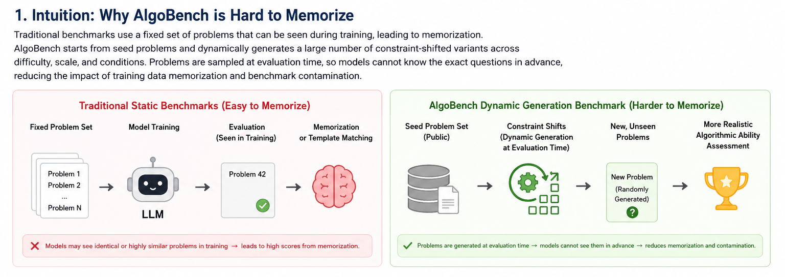
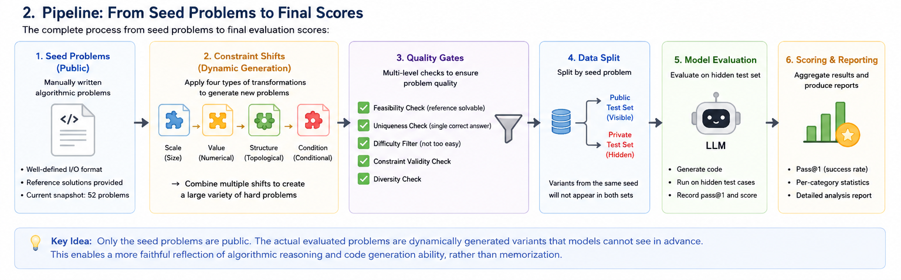

# AlgoBench: A Generative Benchmark for Algorithmic Problem Solving

AlgoBench is a benchmark for evaluating whether large language models can **design the correct algorithm for a newly generated problem**, rather than recall a solution to a fixed, well-known programming task.

The central idea is simple: AlgoBench is not limited to one permanent list of questions. It starts from seed algorithmic problems and applies controlled transformations to their constraints, interaction setting, or objective. These transformations create new problems for which the original algorithm is no longer sufficient. A benchmark run can therefore construct a fresh evaluation set, apply quality gates, and keep part or all of the generated set private until evaluation.

This design reduces the effect of training-set memorization and benchmark contamination. A model may have seen the source problem, its standard solution, or a close competitive-programming variant during pretraining. However, success on AlgoBench requires the model to detect what changed, explain why the old algorithm fails, select a new algorithm, and produce code that is both correct and efficient under the new constraints.

<p align="center">
  
</p>

## Why another algorithm benchmark?

Many code-generation benchmarks use a fixed collection of public problems. Once these problems, reference solutions, tests, and discussions appear online, it becomes difficult to separate algorithmic reasoning from memorization. A high score may partly reflect prior exposure to the exact task or to a nearly identical solution template.

AlgoBench addresses this issue by treating benchmark construction as part of the evaluation process. It supports the following evaluation pattern:

1. collect or define seed problems with known algorithms;
2. generate controlled algorithm-changing variants;
3. reject weak, invalid, or near-paraphrase variants through quality gates;
4. evaluate models on the accepted variants;
5. test both functional correctness and computational efficiency;
6. regenerate or expand the task set for later evaluations.

The released repository contains a **52-problem snapshot** for reproducibility. This snapshot is an example benchmark instance, not the only intended test set. Researchers can build new instances from other seed pools, use different transformation settings, or keep generated variants hidden during model evaluation.

## Benchmark goal

AlgoBench measures whether a model can respond correctly when a familiar algorithmic problem is changed in a way that requires a different solution method.

Each benchmark item contains two related tasks:

- a **source problem**, which has a known reference algorithm and complexity;
- a **shifted problem**, whose constraints, update pattern, or objective invalidate the source solution or make it computationally infeasible.

A successful model must do more than produce code that passes a few examples. Its solution should:

- implement the required input-output behavior;
- pass functional tests;
- avoid the known failure pattern of the source algorithm;
- satisfy the target time and space complexity;
- remain correct at the larger or changed problem scale.

## Generative benchmark design

AlgoBench is best understood as a benchmark generator plus an evaluation pipeline.

<p align="center">
  
</p>

This setup supports three useful modes.

### 1. Public reproducibility mode

Use `data/final_benchmark.jsonl`, the released 52-problem snapshot, to reproduce the reported experiments and analysis.

### 2. Fresh-generation mode

Collect a new seed pool and run the construction pipeline again. This creates a different benchmark instance and lowers the chance that the evaluated model has seen the exact shifted tasks.

### 3. Private evaluation mode

Generate problems before evaluation, but do not release their statements, tests, or target algorithms until the evaluation is complete. This is the recommended mode when contamination resistance is important.

No finite benchmark can prove that a model has never seen related material. AlgoBench instead reduces exact-item recall by making the final evaluation tasks generated, changeable, and optionally private.

## Transformation operators

The current release contains 52 accepted problems across four operators.

| Operator | Count | Description | Required model behavior |
|---|---:|---|---|
| **Constraint Scale (CS)** | 16 | Increases input size or tightens resource limits so that the source algorithm becomes too slow or memory-intensive. | Replace the source method with a lower-complexity algorithm or data structure. |
| **Static to Dynamic (SD)** | 13 | Converts a one-shot problem into an online, streaming, or update-query problem. | Introduce dynamic data structures, incremental maintenance, rollback, or online processing. |
| **Objective Perturbation (OP)** | 10 | Changes the optimization target while keeping part of the original problem structure. | Re-derive the objective and select an algorithm that optimizes the new target. |
| **Greedy Trap (GT)** | 13 | Adds a condition under which a standard greedy rule is no longer correct. | Detect the counterexample and use an exact, dynamic-programming, or otherwise valid method. |

The operators are designed to change the required algorithm, not merely rewrite the wording. For example, increasing `n` is useful only when it makes the old complexity invalid and a better method is available.

## What contamination resistance means here

AlgoBench does not claim that source algorithms are absent from model training data. Standard methods such as Dijkstra's algorithm, segment trees, dynamic programming, and disjoint-set union are expected to be known.

The benchmark instead tests whether the model can use that knowledge in a newly specified setting. The intended separation is:

- **algorithm knowledge** may be learned during training;
- **the exact evaluation problem and its required adaptation** can be generated after training.

This distinction is important. The goal is not to test whether a model can invent all algorithms from first principles. The goal is to test whether it can identify the correct algorithmic structure under a new constraint shift.

For stronger contamination control, a benchmark release should report:

- whether the final tasks were public before evaluation;
- when the task set was generated;
- which seed sources were used;
- which transformations were applied;
- whether titles, examples, and tests were regenerated;
- how near-duplicates and paraphrases were filtered;
- whether the target model or a related model participated in task generation.

## Repository structure

```text
algobench/
├── README.md
├── LICENSE
├── requirements.txt
├── run_pipeline.sh
├── data/
│   ├── source_problems.jsonl
│   ├── final_benchmark.jsonl
│   └── final_benchmark_summary.json
├── src/
│   ├── stage1_collect.py
│   ├── stage2_transform.py
│   ├── stage4_eval_original.py
│   ├── stage4_evaluate.py
│   ├── stage4_multimodel.py
│   ├── stage5_analyze.py
│   └── stage6_generalization.py
├── scripts/
│   ├── sweep_constraints.py
│   ├── eval_ablation.py
│   ├── eval_ablation_v2.py
│   ├── eval_checker.py
│   ├── compute_shift_metrics.py
│   ├── recompute_tables.py
│   └── gen_*.py
├── results/
│   └── multimodel_results.json
└── analysis/
    ├── table_main.json
    ├── table_ablation.json
    ├── table_checker.json
    ├── shift_metrics_per_problem.json
    ├── algo_taxonomy.json
    └── fig_*.json
```

## Installation

AlgoBench requires Python 3.9 or later.

```bash
git clone <repo-url>
cd algobench
python -m venv .venv
source .venv/bin/activate
pip install --upgrade pip
pip install -r requirements.txt
```

The core dependencies include API clients for OpenAI, Anthropic, and Gemini, together with NumPy, Matplotlib, and tqdm.

Set only the API keys needed for the models you plan to evaluate:

```bash
export OPENAI_API_KEY="your-openai-key"
export ANTHROPIC_API_KEY="your-anthropic-key"
export GEMINI_API_KEY="your-gemini-key"
```

Do not commit API keys to the repository.

## Path configuration

Some experiment scripts preserve absolute paths from the original research environment. Before running them on a new machine, replace entries such as:

```python
/path/to/algobench
/path/to/.openclaw/research_topics/automatic_algorithm_design
/path/to/venv
```

with paths valid on your system.

The more portable scripts, such as `src/stage4_multimodel.py`, derive paths from the repository location. For full portability, the remaining scripts should also be changed to use `pathlib.Path(__file__)` or command-line arguments.

## Quick start with the released benchmark snapshot

The released benchmark instance is stored in:

```text
data/final_benchmark.jsonl
```

A basic multi-model evaluation can be run with:

```bash
python src/stage4_multimodel.py
```

The available models depend on installed packages, API keys, and local model access. Review the model registry near the top of the script before running a large experiment.

To analyze an existing result file, use:

```bash
python src/stage5_analyze.py
python src/stage6_generalization.py
```

Because several scripts contain environment-specific paths, inspect and update their configuration constants first.

## Building a fresh benchmark instance

### Stage 1: collect seed problems

`src/stage1_collect.py` supports several seed sources:

```bash
# Use the built-in curated seed set
python src/stage1_collect.py

# Add problems from DeepMind Code Contests
python src/stage1_collect.py --source codecontests --max-problems 200

# Add problems through the Codeforces API
python src/stage1_collect.py --source codeforces --max-problems 200

# Load a local JSONL seed file
python src/stage1_collect.py \
  --source file \
  --file-path /path/to/problems.jsonl

# Combine supported sources
python src/stage1_collect.py --source all --max-problems 200
```

A seed problem should define its statement, constraints, input-output format, examples, reference algorithm, and reference complexity. A seed may already contain a shifted variant, or it may be marked for later generation.

### Stage 2: transform and validate

```bash
python src/stage2_transform.py
```

This stage formats candidate shifts and applies validity checks. A good shifted item should satisfy all of the following:

- the shifted task is well-defined;
- its examples match its specification;
- the source solution is invalid or too slow under the shifted setting;
- the target algorithm solves the shifted task;
- the target complexity is consistent with the new constraints;
- the shift is not only a superficial paraphrase.

Accepted items are written to:

```text
data/final_benchmark.jsonl
```

### Stage 3: keep a hidden evaluation split

For contamination-resistant evaluation, divide accepted tasks into public development and private test sets. The private split should not be placed in a public repository before model evaluation.

A recommended release structure is:

```text
data/public_dev.jsonl
private/test.jsonl          # not committed
private/tests/              # not committed
```

The public set can be used to verify formatting and execution. The private set should be used for final scores.

### Stage 4: evaluate models

The repository provides single-model and multi-model evaluation scripts:

```bash
python src/stage4_evaluate.py
python src/stage4_multimodel.py
```

The evaluation code constructs prompts from the shifted problem fields, obtains model-generated Python programs, executes them under a timeout, and records correctness and efficiency-related signals.

### Stage 5: analyze results

```bash
python src/stage5_analyze.py
python scripts/compute_shift_metrics.py
python src/stage6_generalization.py
```

These scripts aggregate scores by model, prompting strategy, and transformation operator. They also estimate the distance between source and shifted tasks.

## Full pipeline

After updating the paths in `run_pipeline.sh`, run:

```bash
bash run_pipeline.sh
```

The pipeline performs collection, transformation, evaluation, and analysis. If no OpenAI API key is set, the evaluation stage is skipped.

## Benchmark data format

Each line of `data/final_benchmark.jsonl` is one JSON object. The released file uses the following main fields.

| Field | Meaning |
|---|---|
| `id` | Unique problem identifier. |
| `title` | Human-readable problem title. |
| `operator` | Transformation type: `CS`, `SD`, `OP`, or `GT`. |
| `source_statement` | Source problem statement. |
| `source_constraints` | Constraints for the source problem. |
| `source_input` | Source input specification. |
| `source_output` | Source output specification. |
| `source_examples` | Source examples. |
| `source_reference_algorithm` | Known algorithm for the source task. |
| `source_complexity` | Expected time and space complexity of the source algorithm. |
| `shifted_statement` | Generated or curated shifted problem statement. |
| `shifted_constraints` | Constraints after transformation. |
| `shifted_input` | Shifted input specification. |
| `shifted_output` | Shifted output specification. |
| `shifted_examples` | Examples for the shifted task. |
| `target_algorithm` | Algorithm expected to solve the shifted task. |
| `target_complexity` | Required time and space complexity. |
| `old_solution_failure` | Explanation of why the source algorithm fails. |
| `trap_patterns` | Common incorrect or suboptimal solution patterns. |
| `gate1_result` | Stored result of the old-solution failure gate, when available. |
| `benchmark_status` | Benchmark acceptance or processing status. |
| `created_at` | Item creation timestamp, when available. |

Example skeleton:

```json
{
  "id": "CS001",
  "title": "Example shifted task",
  "operator": "CS",
  "source_statement": "...",
  "source_constraints": "...",
  "source_reference_algorithm": "...",
  "source_complexity": {
    "time": "O(n^2)",
    "space": "O(n)"
  },
  "shifted_statement": "...",
  "shifted_constraints": "...",
  "target_algorithm": "...",
  "target_complexity": {
    "time": "O(n log n)",
    "space": "O(n)"
  },
  "old_solution_failure": "The source method exceeds the new time limit.",
  "trap_patterns": [
    "reuse the source algorithm",
    "apply an invalid greedy rule"
  ]
}
```

## Evaluation settings

The repository supports several prompting settings.

| Setting | Description |
|---|---|
| `direct` | The model receives the shifted problem and directly generates a solution. |
| `cot` | The prompt asks the model to reason before producing code. |
| `rag_source` or `rag` | The model is also given source-task information or a source solution. |

The RAG setting is intentionally challenging: access to the source solution may help the model understand the task family, but it may also anchor the model to an algorithm that is no longer valid.

## Metrics

AlgoBench separates correctness from algorithmic efficiency.

### Functional correctness

Generated code is executed on available examples or tests. Common reported measures include `pass@1` and `pass@5`.

### Target-complexity success

A solution should meet the complexity required by the shifted problem. The repository includes static, tag-based, and runtime-based checker experiments. Complexity verification is approximate and should be reported with its assumptions.

### Trap rate

The trap rate measures how often a model uses a known incorrect or suboptimal pattern, including reuse of the source algorithm after the shift invalidates it.

### Shift score

Some result files use a composite score that combines correctness and success under the shifted complexity requirement. Researchers should state the exact formula used in their experiment.

### Generalization-gap measures

`src/stage6_generalization.py` and related analysis files characterize the difference between source and shifted tasks using factors such as text similarity, constraint changes, complexity changes, and algorithm-family distance.

## Quality gates

A generative benchmark is useful only when generated tasks are valid. AlgoBench includes experiments for checking four common failure modes:

- **G1: old-solution survival** — the source algorithm still solves the shifted task;
- **G2: reference-solution failure** — the claimed target algorithm does not solve the shifted task;
- **G3: near paraphrase** — the shifted task changes wording but not algorithmic content;
- **G4: complexity mismatch** — the target complexity label is inconsistent with the reference solution or constraints.

The ablation scripts study how benchmark quality changes when these gates are removed:

```bash
python scripts/eval_ablation.py
python scripts/eval_ablation_v2.py
```

The checker validation experiment can be run with:

```bash
python scripts/eval_checker.py
```

These scripts may call language-model APIs and may incur cost.

## Reproducing the released analyses

Precomputed outputs are included for inspection.

`results/multimodel_results.json` contains model-level evaluation records. The `analysis/` directory contains processed tables and figure data, including:

- `table_main.json`: main model and strategy comparison;
- `table_breakdown.json`: results split by problem groups;
- `table_shift.json`: results by shift type;
- `table_ablation.json` and `table_ablation_v2.json`: quality-gate ablations;
- `table_checker.json`: complexity-checker validation;
- `shift_metrics_per_problem.json`: per-problem shift statistics;
- `tier_analysis.json`: analysis by model tier;
- `algo_taxonomy.json`: algorithm-family coverage;
- `fig_*.json`: data used to generate figures.

Exact model availability and API model names may change over time. Record the provider, model identifier, access date, decoding parameters, and any model substitution when reproducing results.

## Recommended protocol for a new evaluation

A contamination-aware AlgoBench study should use the following protocol:

1. freeze the evaluated model and model version;
2. define the seed sources and generation operators;
3. generate more candidates than needed;
4. apply correctness, nontriviality, and complexity quality gates;
5. remove exact and near duplicates from public benchmarks;
6. separate public development tasks from private test tasks;
7. generate hidden tests independently from prompt examples;
8. evaluate code in a sandbox with fixed resource limits;
9. report correctness and complexity separately;
10. release generation metadata and the test set after evaluation, when permitted.

When the same language model is used both to generate tasks and to solve them, report that fact and include cross-generator tests where possible. For example, tasks generated by one model family can be evaluated on another model family, followed by a reversed setting.

## Adding a new transformation operator

A new operator should define:

- what part of the source problem changes;
- why the source algorithm fails;
- what algorithm family is expected after the shift;
- how correctness is tested;
- how the target complexity is checked;
- what invalid shortcuts or trap patterns should be recorded.

After adding the operator, update the collection schema, transformation code, evaluator grouping, and analysis tables. New operators should be tested on multiple algorithm families rather than a single task template.

## Adding a new seed source

`src/stage1_collect.py` uses a source interface for collecting problems. A new source should return the standard seed schema and preserve source-license metadata. Suitable sources include:

- locally authored problems;
- licensed programming datasets;
- public contest APIs, subject to their terms;
- domain-specific algorithm tasks;
- synthetic source problems generated from formal specifications.

Do not assume that public availability gives permission to redistribute a problem statement. Review the license and terms of each source.

## Limitations

AlgoBench reduces dependence on fixed public questions, but it does not remove all contamination or evaluation risks.

First, generated tasks can still be too similar to known problems. Near-duplicate filtering and human review remain useful. Second, a generator model may reproduce memorized contest material. Third, generated examples may be weak or incorrect. Fourth, static complexity checking cannot fully determine asymptotic behavior from arbitrary code. Fifth, API-based evaluation can change when providers update model implementations.

For these reasons, results should include generation details, quality-gate outcomes, execution settings, model versions, and checker limitations.

## Citation

```bibtex
@inproceedings{algobench2026,
  title     = {AlgoBench: Evaluating LLMs on Generated Constraint-Shifted Algorithmic Problems},
  author    = {Anonymous},
  booktitle = {Under Review},
  year      = {2026}
}
```

Replace the anonymous citation after publication.

## License

The code in this repository is released under the MIT License. See [LICENSE](LICENSE).

Benchmark items may be derived from external programming-problem sources. Their statements, examples, and metadata may remain subject to the licenses or terms of the original sources. Users are responsible for checking redistribution and evaluation rights for any added seed dataset.
